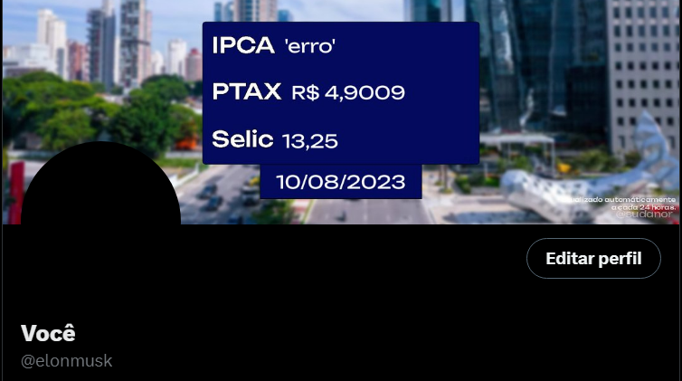

# brazil-twitter-rates

#### 📊 Atualiza o seu banner do Twitter a cada 24h com as prinicpais taxas monetárias do Brasil.

Simples bot do Twitter que altera o seu banner a cada **24 horas** usando Node.JS, feito apenas para fins de estudo mas decidi postar por ter ficado satisfeito com o resultado. 😀 
Ainda pretendo colocar algumas outras coisas e refatorar o código por completo, fiz ele só para "_experimentar_" a API do Twitter (vulgo X).

## Bibliotecas utilizadas:
- twitter-api-v2: API do Twitter para alterar o banner.
- node-canvas (aka canvas): Gerar os textos por cima da imagem.
- fs: Salvar a imagem gerada e deletar posteriormente.
- moment?: Só para pegar a data atual de um jeito formatado.

### Resultado final:

``p.s: O site do IBGE nem sempre retorna a taxa IPCA por algum motivo que eu não fui atrás de descobrir...``
